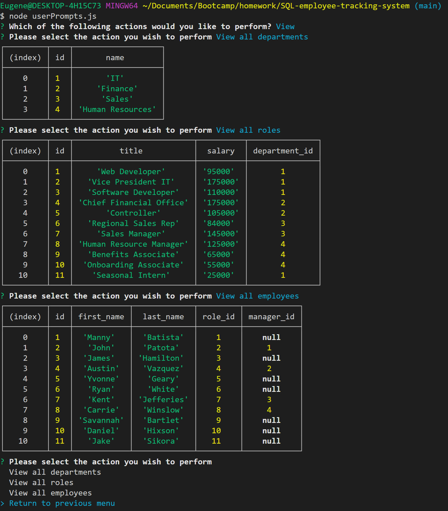
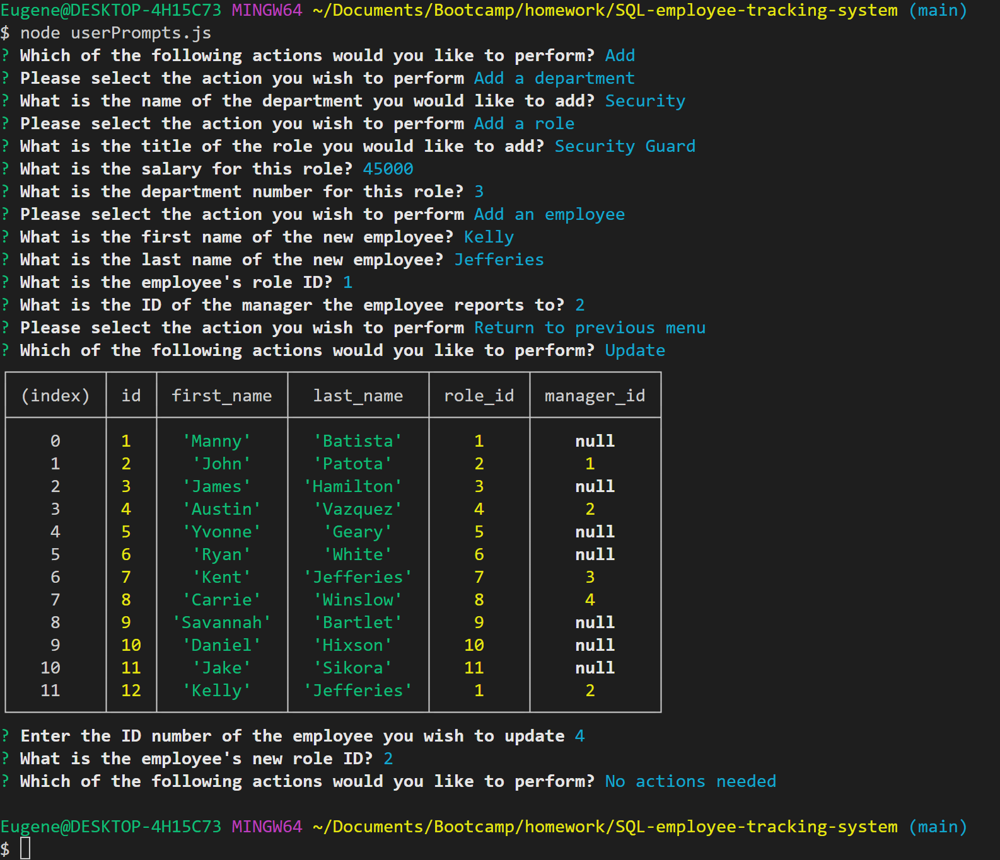

# SQL-employee-tracking-system

## Table of Contents

- [Description](#description)
- [Installation](#installation)
- [Media](#media)
- [GitHub Repository](#github-repository)
- [Contributors](#contributors)

## Description

My SQL Employee Tracking System is a command-line application to manage a company's employee database, using Node.js, Inquirer, and MySQL.

## Installation

- Clone the repository to your local machine
- Install local dependencies
    * Install npm: 'npm install'
    * Install express: 'npm install express'
- Right click on 'package.json' and select open integrated terminal
- Enter 'npm userPrompts.js' and the application will start
- Follow the prompts to perform the action desired.

## Media

[Video link to my SQL Employee Tracking in use](https://drive.google.com/file/d/1YLelLeE-wJggDJhGMZTvTbMlizGQrSF8/view?usp=sharing)

## GitHub Repository

[Repository link for my SQL Employee Tracking program](https://github.com/eugene125/SQL-employee-tracking-system)

## Contributors

- Kelly Jefferies
- Daniel Norred

## Technologies Used:
- Javascript
- Node
- [Express.js](https://expressjs.com/)
- MySQL2

## License:

